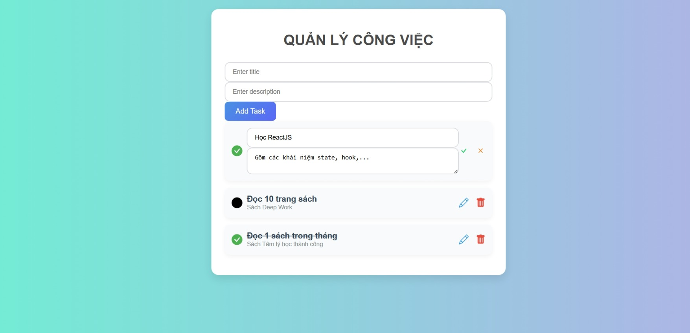

# ✅ Dự án Quản lý Công Việc (TodoList App)

Ứng dụng giúp người dùng tạo, quản lý và theo dõi tiến độ công việc hàng ngày. Dự án bao gồm frontend viết bằng **ReactJS** và backend viết bằng **Spring Boot**.

---

## 🎯 Tính năng chính

- Thêm công việc mới 📝  
- Đánh dấu hoàn thành ✅  
- Chỉnh sửa nội dung ✏️  
- Xóa công việc ❌
- Lưu trữ dữ liệu trên backend (REST API)

---

## 🖼️ Giao diện demo



---

## ⚙️ Cài đặt

### 🧩 Frontend (ReactJS)

```bash
cd frontend
npm install
npm run dev

Backend (Spring Boot)
Mở thư mục backend bằng IntelliJ IDEA

Chạy class BackendApplication.java

Đảm bảo bạn đã cấu hình cơ sở dữ liệu (MySQL)